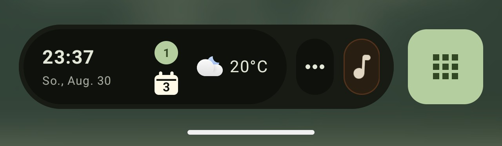
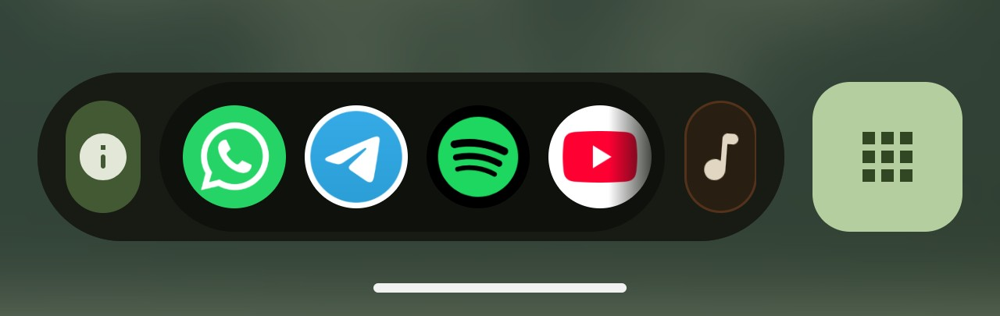
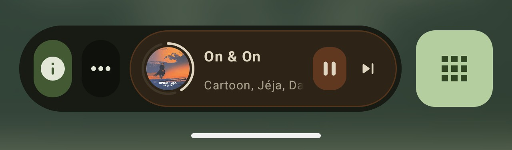
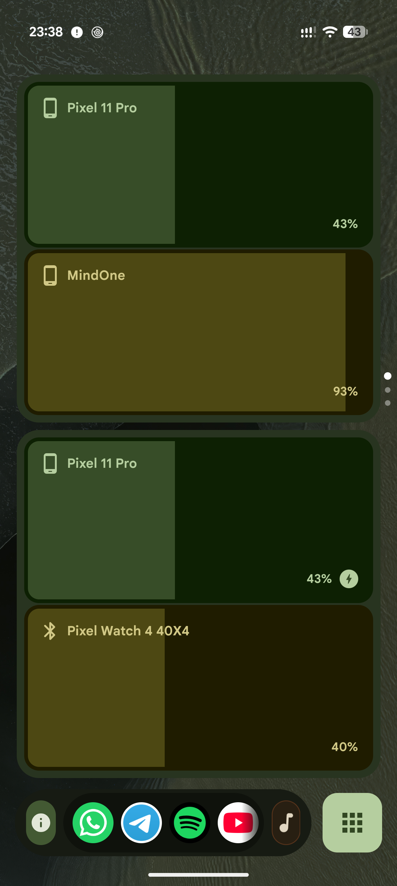
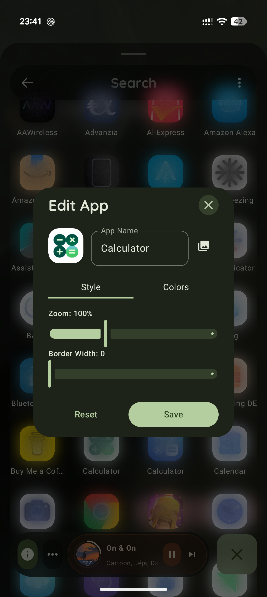
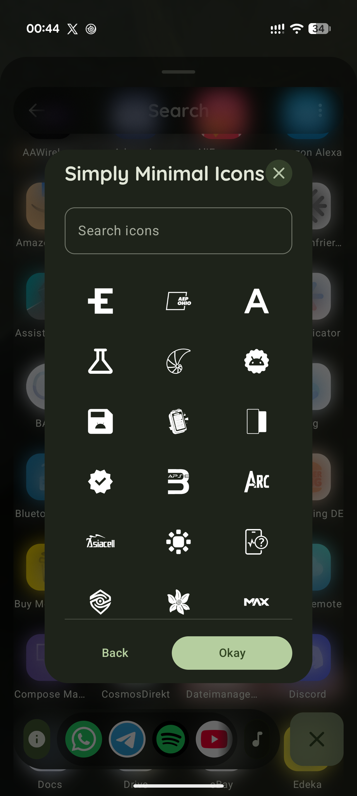

  

# Xenon Launcher 🚀
     

**Xenon Launcher** is a high-performance, minimalist home screen replacement built from the ground up with Jetpack Compose. It bridges the gap between extreme customization and clean aesthetics, offering a fluid experience that adapts to your digital life in real-time.

---

## 📸 Screenshots
|                                                  App Drawer                                                   | Media Player |             At a Glance / Notifications             |
|:-------------------------------------------------------------------------------------------------------------:| :---: |:---------------------------------------------------:|
|   |  |  |
|                                             **Global Icon Pack**                                              | **Docks** | **Settings** |
|                                                         |    |  |
|                                                  **Widgets**                                                  | **Edit Dialog** | **Icon Selection** |
|                                                                 |  |  |

---

## 🚀 Key Features

### 1. Visual Icon Management & Split-Screen
Stop guessing resource names. Xenon features a **native visual grid browser** for icon packs and advanced multitasking.
*   **Live Preview:** See every icon in a pack before you apply it.
*   **Split-Screen Multitasking:** Launch apps directly into split-screen mode from the app drawer with a dedicated app picker for the second slot.
*   **Manual Overrides:** Long-press any app to swap its icon, adjust zoom levels, or add custom borders.

### 2. The Theming Engine & Variable Fonts
Xenon provides three layers of aesthetic control to ensure your device looks exactly how you want.
*   **Typography Tweaks:** Full support for **Variable Fonts** (Roboto Flex & Google Sans Flex). Adjust weight, width, and slant with precision sliders.
*   **Global Packs:** Apply an entire icon pack to every app with a single tap.
*   **Icon Shaping:** Full support for Material adaptive shapes including `Squircle`, `Circle`, and `Teardrop`.

### 3. Glassmorphism & Immersive Media
A dedicated space that transforms into a beautiful, full-screen playback controller.
*   **Haze Glass Effects:** High-performance frosted glass blur across the UI, powered by the Haze library.
*   **Dynamic Blur:** The media page background adapts to your current track's album art using real-time blurring.
*   **Color Extraction:** UI elements automatically shift their tint to match the dominant colors of the artwork.

### 4. Intelligent "At a Glance"
Stay organized with a sophisticated dashboard that monitors your schedule and environmental conditions.
*   **Live Chronometrics:** Real-time monitoring of active timers, stopwatches, and upcoming alarms directly in the header.
*   **Dynamic Weather:** Integrated temperature and condition updates with localized forecasts.
*   **Proactive Sync Fixer:** Automatically detects if Google Calendar is syncing and pairs the connection with a single tap.
*   **Smart Ranking:** Prioritizes current, upcoming, and all-day events so you always see what matters most.
*   **Multi-Account:** Aggregates events from all your signed-in calendars into one unified, clean view.

### 5. Cloud Continuity & Identity
Never lose your setup again. Xenon includes a secure **Backup & Restore** system.
*   **Credential Manager:** Seamlessly sign in and sync settings using the latest Android Identity and Google ID APIs.
*   **Instant Migration:** Restore your entire home screen layout, icon overrides, and hidden apps in seconds on a new device.

---

## 🛠 Feature Library

<b>Click to expand full feature list</b>

| Category | Features |
| :--- | :--- |
| **Customization** | Variable Fonts (Flex), Adaptive Shapes, Icon Shadows, Custom Zoom, Border Control, Haze Glass Blur |
| **Theming** | Global Icon Packs, Manual Overrides, "Blacked Out" AMOLED Mode, Dynamic Material 3 Colors |
| **At a Glance** | Live Timers & Alarms, Real-time Weather, Calendar Sync Monitoring, Multi-Account Events |
| **Search** | Unified Search (Apps, Contacts, Files with Previews, Web), Search History Management |
| **Multitasking** | Native Split-Screen Launcher, Efficiency Dock, Pinned Apps, FAB Shortcuts (Swipe/Double Tap/Long Press) |
| **Widgets** | App Widgets & Shortcuts, Separate Portrait/Landscape Layouts, Customizable Grid Size |
| **Privacy** | Hidden Apps (Hide from Drawer & Search), Local Data Processing, Credential Manager Identity |

---

## 🏗 Technical Overview

### How it Works
1.  **Jetpack Compose:** The entire UI is declarative and state-driven, ensuring zero jank and fluid animations.
2.  **Modern Core:** Built on **Kotlin 2.1**, **Java 21**, and targeting **Android 15 (API 37)**.
3.  **Accessibility Service:** Utilizes a lightweight Accessibility Service solely to enable "Tap to Lock" and Split-Screen gestures.
4.  **Scoped Storage:** Efficiently manages icon caching and file thumbnails while respecting Android's latest privacy standards.

---

## 🛡 Privacy & Security
*   **Local First:** Your app usage data, hidden apps, and search history never leave your device unless you manually trigger a cloud backup.
*   **No Tracking:** Xenon Launcher contains no analytics or tracking SDKs.
*   **Transparent Permissions:** Each permission (Calendar, Contacts, Storage) is optional and only used to power the specific feature you enable.

### [Read our Privacy Policy](PRIVACY_POLICY.md)

---

## 📄 License
This project is licensed under the **MIT License** - see the [LICENSE](LICENSE) file for details.

---

## 👨‍💻 Developer
*   **Company:** Xenonware
*   **Lead:** Nico (Dinico414)

---
*Disclaimer: This app uses Accessibility Services for screen-locking and multitasking functionality. It is not affiliated with Google LLC, Nova Launcher, or any other home screen provider.*
