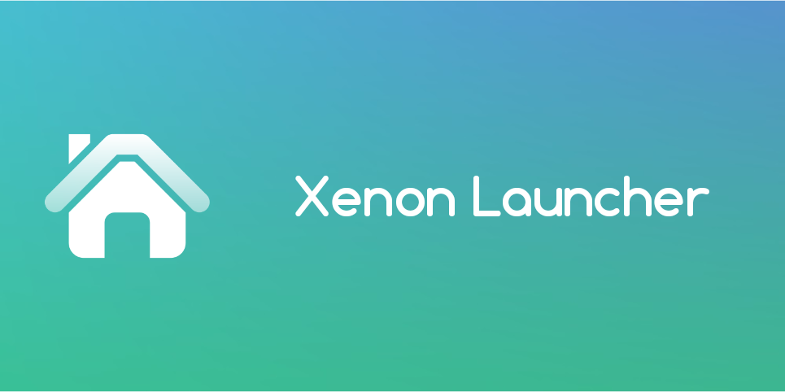
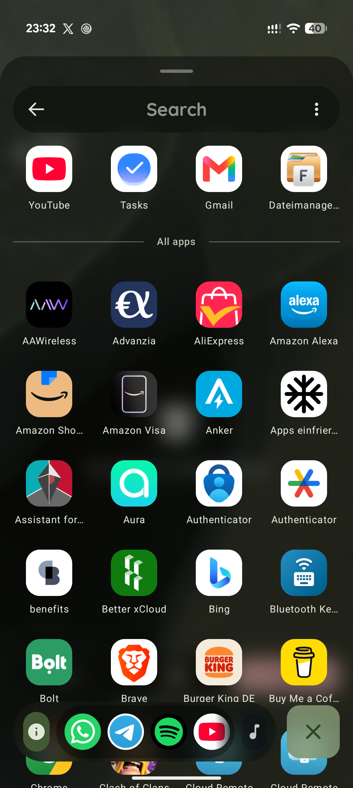
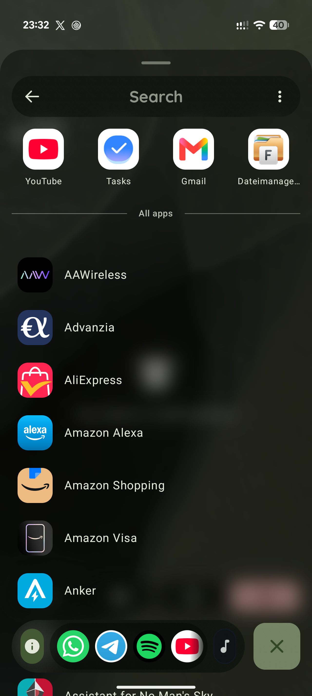
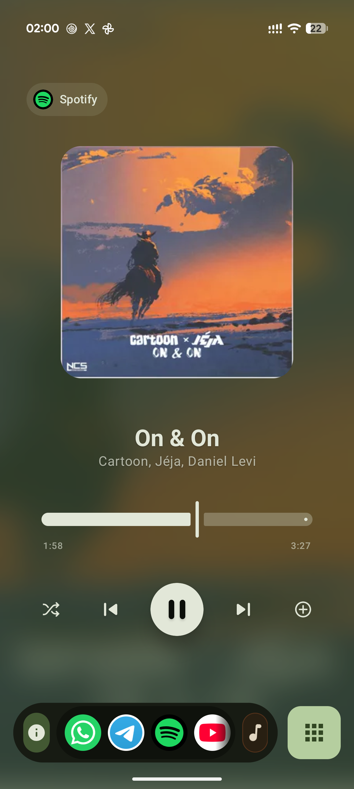
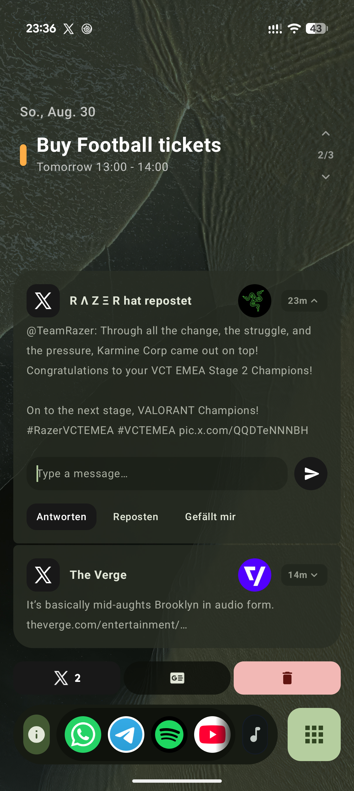
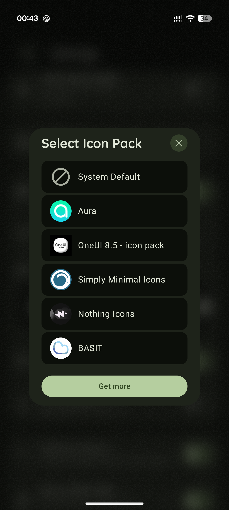
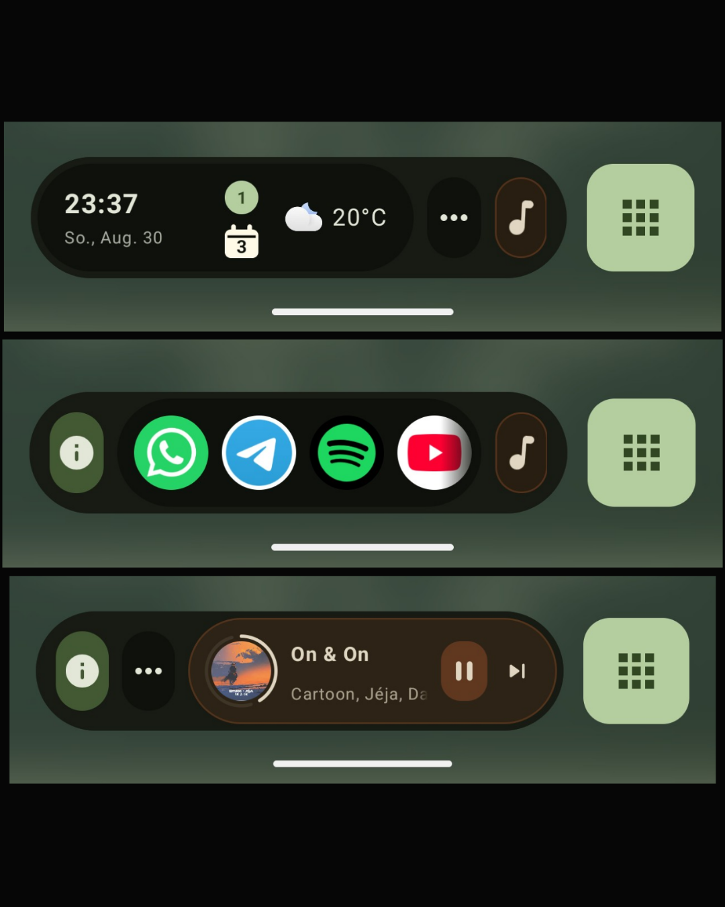
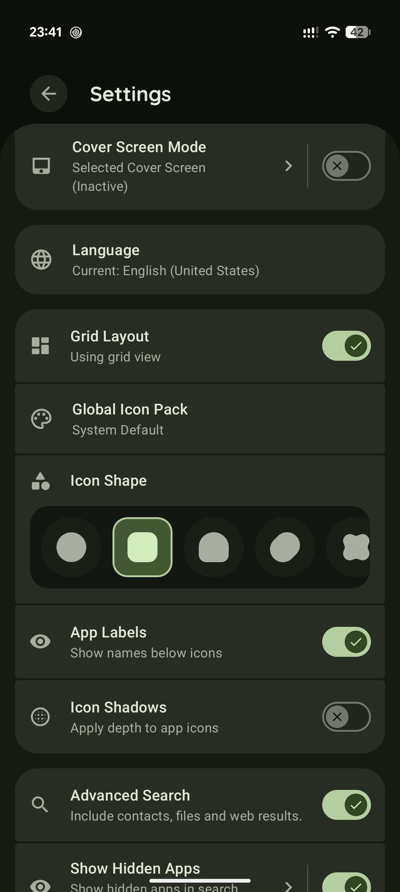

  

# Xenon Launcher 🚀
     

**Xenon Launcher** is a high-performance, minimalist home screen replacement built from the ground up with Jetpack Compose. It bridges the gap between extreme customization and clean aesthetics, offering a fluid experience that adapts to your digital life in real-time.

---

## 📸 Screenshots
| App Drawer | Media Player |             At a Glance / Notifications             |
| :---: | :---: |:---------------------------------------------------:|
|   |  |  |
| **Global Icon Pack** | **Docks** |                    **Settings**                     |
|  |  |      |

---

## 🚀 Key Features

### 1. Visual Icon Management
Stop guessing resource names. Xenon features a **native visual grid browser** for icon packs.
*   **Live Preview:** See every icon in a pack before you apply it.
*   **Smart Search:** Instantly filter thousands of icons by name to find the perfect match.
*   **Manual Overrides:** Long-press any app to swap its icon, adjust zoom levels, or add custom borders.

### 2. The Theming Engine
Xenon provides two layers of aesthetic control to ensure your device looks exactly how you want.
*   **Global Packs:** Apply an entire icon pack to every app with a single tap.
*   **Persistence:** Individual app customizations are smartly preserved even when swapping global themes.
*   **Icon Shaping:** Full support for Material adaptive shapes including `Squircle`, `Circle`, and `Teardrop`.

### 3. Immersive Media Page
A dedicated space that transforms into a beautiful, full-screen playback controller.
*   **Dynamic Blur:** The entire page background adapts to your current track's album art using real-time blurring.
*   **Color Extraction:** UI elements automatically shift their tint to match the dominant colors of the artwork.
*   **Seamless Control:** Standard playback buttons paired with custom actions pulled directly from your favorite music apps.

### 4. Intelligent "At a Glance"
Stay organized with a sophisticated calendar engine that does more than just list events.
*   **Sync Monitoring:** Automatically detects if Google Calendar is actually syncing your accounts and alerts you if data is missing.
*   **Multi-Account:** Aggregates events from all your signed-in calendars into one unified, clean view.
*   **Contextual Ranking:** Prioritizes upcoming and currently running events so you always see what matters most.

### 5. Cloud Continuity
Never lose your setup again. Xenon includes a built-in **Backup & Restore** system.
*   **Cloud Sync:** Securely save your settings and icon modifications to your personal cloud account.
*   **Instant Migration:** Moving to a new phone? Sign in and restore your entire home screen layout in seconds.

---

## 🛠 Feature Library

<b>Click to expand full feature list</b>

| Category | Features |
| :--- | :--- |
| **Customization** | Adaptive Shapes, Icon Shadows, Custom Zoom, Border Width Control, Frosted Glass Blur |
| **Theming** | Global Icon Packs, Manual Overrides, "Blacked Out" AMOLED Mode, Dynamic Material 3 Colors |
| **Search** | Unified Search (Apps, Contacts, Files, Web), Search History Management |
| **Efficiency** | Efficiency Dock, Pinned Apps, FAB Shortcuts (Double Tap/Long Press), Gesture Support |
| **Privacy** | Hidden Apps (Hide from Drawer & Search), Local Data Processing |
| **System** | Backup & Restore, Custom Shortcuts (Time/Date/Weather), Language Overrides |

---

## 🏗 Technical Overview

### How it Works
1.  **Jetpack Compose:** The entire UI is declarative and state-driven, ensuring zero jank and fluid animations.
2.  **Accessibility Service:** Utilizes a lightweight Accessibility Service solely to enable "Tap to Lock" functionality without requiring root or device admin.
3.  **Scoped Storage:** Efficiently manages icon caching and thumbnails while respecting Android's latest privacy standards.

---

## 📥 Installation

1. **Sideload the APK** from the [Downloads](#-downloads) section.
2. **Enable Accessibility (Optional):** If you wish to use the double-tap to lock feature, enable the Xenon Accessibility Service in your system settings.
3. **Cloud Sync:** Sign in with Google within the launcher settings to enable backups.

---

## 🛡 Privacy & Security
*   **Local First:** Your app usage data, hidden apps, and search history never leave your device unless you manually trigger a cloud backup.
*   **No Tracking:** Xenon Launcher contains no analytics or tracking SDKs.
*   **Transparent Permissions:** Each permission (Calendar, Contacts, Storage) is optional and only used to power the specific feature you enable.

---

## 📄 License
This project is licensed under the **MIT License** - see the [LICENSE](LICENSE) file for details.

---

## 👨‍💻 Developer
*   **Company:** Xenonware
*   **Lead:** Nico (Dinico414)

---
*Disclaimer: This app uses Accessibility Services for screen-locking functionality. It is not affiliated with Google LLC, Nova Launcher, or any other home screen provider.*
